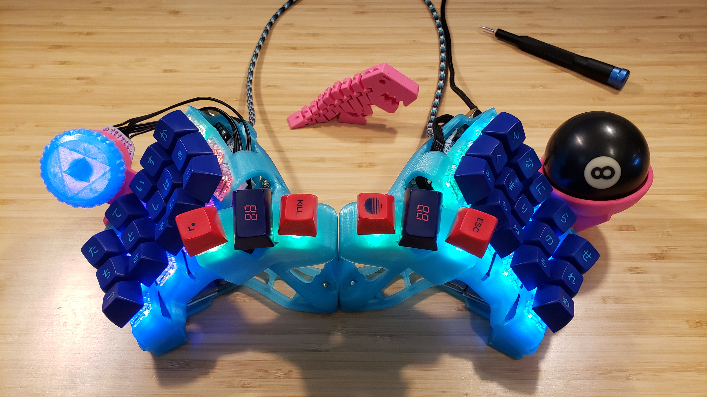
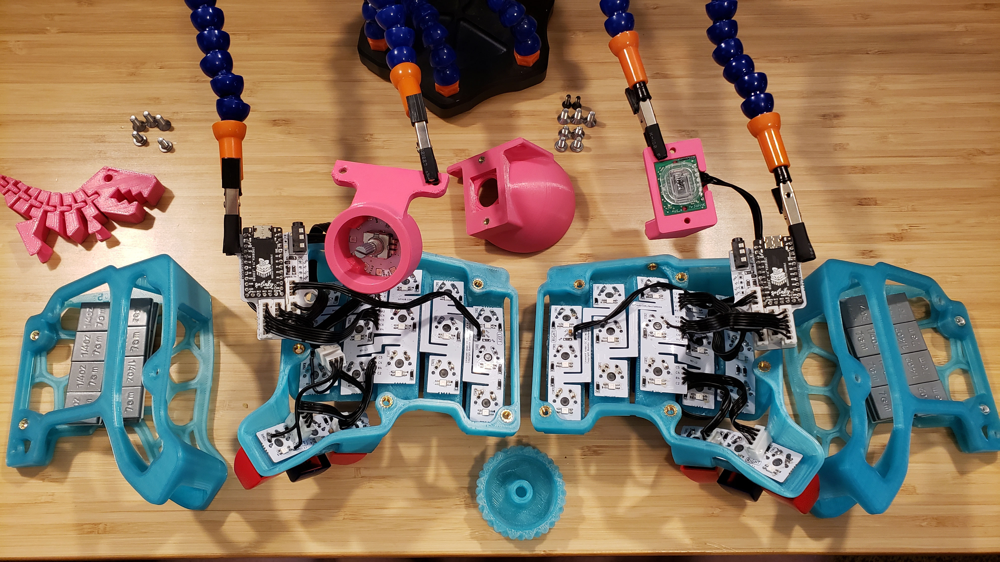
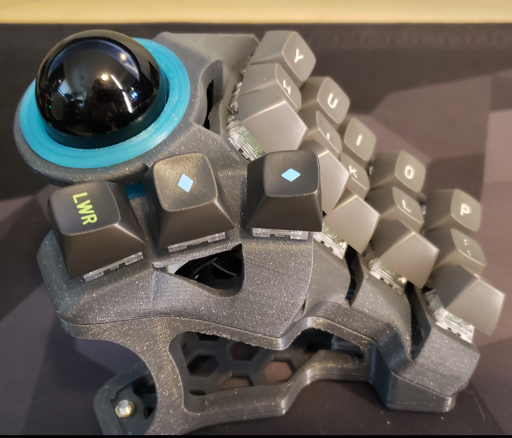
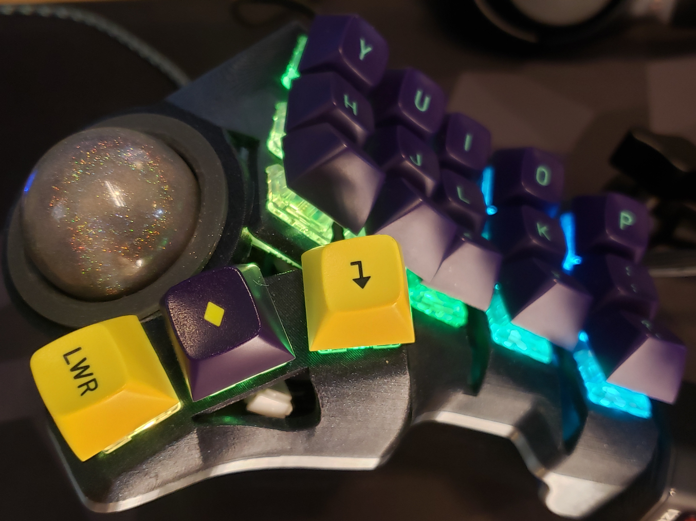
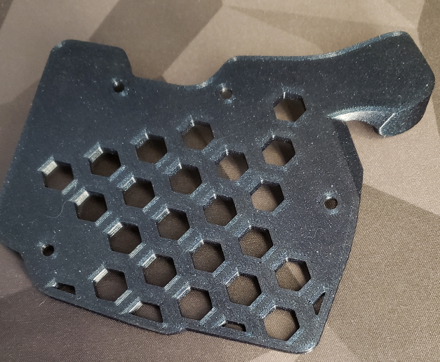

# 3x5+3
Modification of the Skeletyl to add a trackball, encoder and other mods. 
# Firmware
There is currently no official firmware for this build yet. Depending on which MCU is used the develop branch of QMK might need to be used.  

## Trackball
Base the firmware build off of bastardkb/charybdis/3x5 and copy the keymap from the Skeletyl to get the third thumb key on the right hand side.   
Trackball rotation adjustments would need to be made to the trackball orientation in the config.c file.  
## Encoder
To add the encoder The encoder functionality needs to be added as well as adding another key to the keymap for the push key on the encoder. The 12 LEDS need to be added to the map.   
Reference https://github.com/Bastardkb/Charybdis-EC11 for instructions on how it's wired.  
# Mounted Mods
This is a mod of the Skeletyl v4. This gives the ability to mount different mods to the inside or top of the keyboard.  
The mounting holes use M4 screws with heat inserts that are 45mm apart.  
JST XH 2.5mm connectors were used to attach the mods to the MCU board so they can be swapped out easily.

Assembled

Disassembled

## Mods 
Currently only the top mount options has been developed.

### Trackball Mod
There are two of trackball sizes available 55mm or a 57.15 mm (2.25 inch) billiard ball.  
Two M3 screws are used to mount the cover/sensor board.
The ball bearings are 3.175mm (1/8 inch).  
They are designed for a pmw3360 or pmw3389 board from tindie.  
The charybdis-pmw-3360-sensor-pcb could be used but the bottom cover will not fit and the holes are slightly off but the heat insert could be adjusted to get it to work.  
There is a bottom version specific to the 30 degree tented version that has an angled stand to support the trackball weight.  

### Encoder Mod
This uses the Charybdis EC11 pcb board with a 20mm tall EC11 encoder.  
The knobs provided use the round shaft.  
There are two knob variants a blank one and one with a second iteration Sierpiński triangle design. Both variants have domes for one finger top operation.  

## Plates
Any of the Skeletyl v4 plates can be used. The tenting models are in the Chaybdis/3x5 nano/tent the ones shown in the picture is the 30 degree alien tent with voronoi plate. Beware of interference with non tented options as the bottom of the mods protrude slightly.     
  
# HighTrackball and LowTrackball
This is a mod of the Skeletyl v3 to add the trackball mount to the inside of the keyboard. 

The tall version will not interfere with the base plate allowing any Skeletyl v3 base plates and tents to be used.

The low version's trackball will interfere with the base plate requiring a cutout in the plate for it to fit. This also means it will not lay flat and requires tenting.

## Plates
The chair mount plates requires a heat insert for 1/4 inch camera mount threads.

High Version  

  
Low Version  

  
The required cut in the plate to fit the trackball in the low version.  
