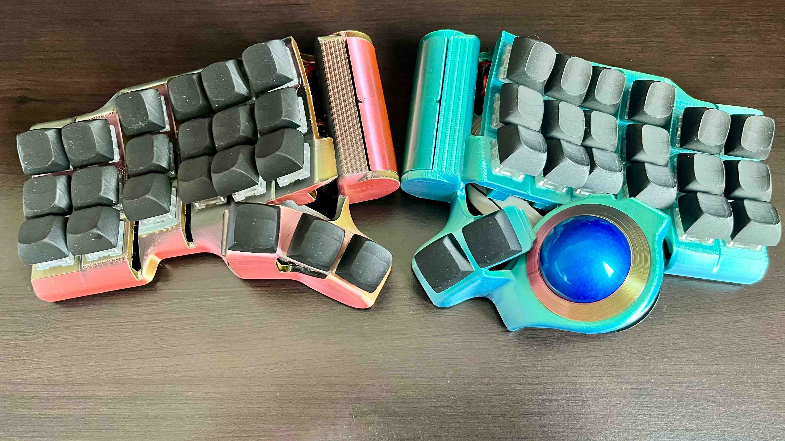
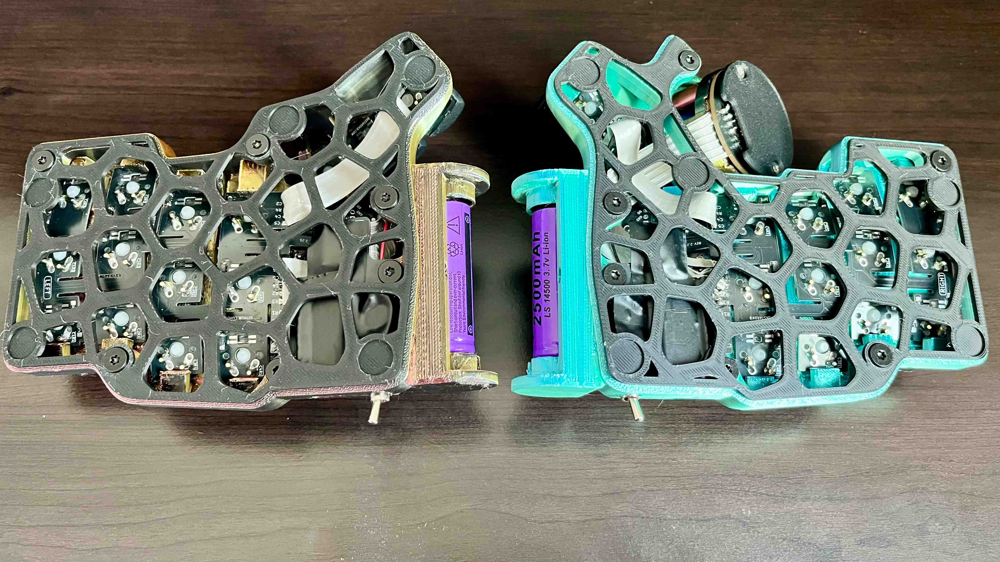
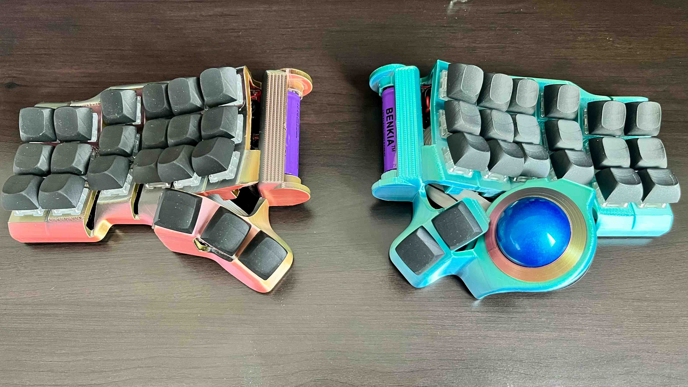

# Battery holder for wireless builds

The conventional wireless build for the Charybdis line of keyboards uses Li-Ion batteries, like the 401030 130mAh battery. 
The internal housing, which is specifically designed to be a wired keyboard, limits the battery size. 

Lower battery sizes offer less battery capacity, thereby reducing the battery life on the keyboard.

ZMK battery life can be computed here: https://zmk.dev/power-profiler

This mod provides (14500 3.7v Li-Ion battery) holders to the Charybdis. This will increase the battery capacity usable for Charybdis to 2500-3800mAh from current values of 130-300mAh. This repository contains files for the right and left cases for the "Mini" and "Nano" versions of the Charybdis.

## Compatibility
The following models have been confirmed working:

1. Charybdis Mini with AA battery (14500 3.7v Li-Ion battery)
1. Snap Fit Cases for Charybdis Mini

- versions for Charybdis Nano are not tested
- compatibility with tenting mechanisms are not tested

## 3D models

The files are in the `charybdis_nano` and `charybdis_mini` folder.

## Showcase

|  | 
|:--:| 
| Charybdis Mini With AA Battery (Top View) |

|  | 
|:--:| 
| Charybdis Mini With AA Battery (Bottom View Showing Mill-Max Hotswap With Snap Fit PCB) |

|  | 
|:--:| 
| Charybdis Mini With AA Battery (Top View Without Battery Holder Cover) |

## Build guide

A build guide can be found in the [build guide file](build_guide.md).