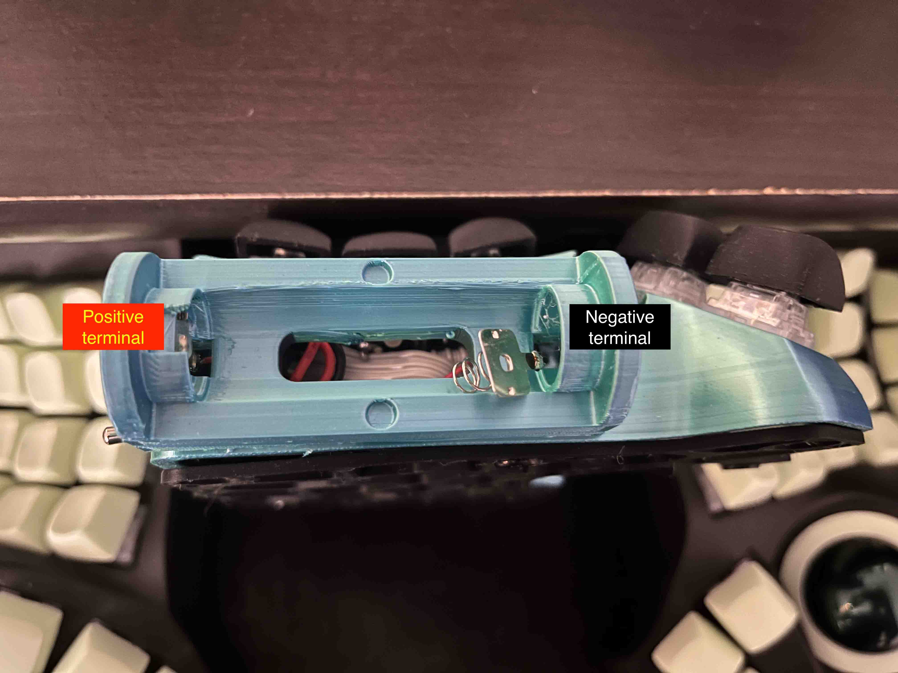

## Verification

I have only verified the prints for the below models:

1. Charybdis Mini with AA battery (14500 3.7v Li-Ion battery)
2. Snap Fit Cases for Charybdis Mini(as this uses the same base design for snap fits present in point#1)

Versions for Charybdis Nano are not yet tested, this document will be updated in the future when it is tested.

Compatibility with tenting mechanisms are not yet tested. This document and the files will be updated in the future based on tests/feedback.

# Showcase

| ") | 
|:--:| 
| *Charybdis Mini With AA Battery (Top View).* |

| ") | 
|:--:| 
| *Charybdis Mini With AA Battery (Bottom View Showing Mill-Max Hotswap With Snap Fit PCB).* |

| ") | 
|:--:| 
| *Charybdis Mini With AA Battery (Top View Without Battery Holder Cover).* |

Charybdis is an ergonomic, open source keyboard designed and developed by <a href="https://github.com/Bastardkb/Charybdis" target="_blank" style="color: #02c2db; text-decoration: underline;text-decoration-style: dotted;"> Bastardkb</a>.

#### Regarding Snap Fits
The conventional build for the Charybdis line of keyboards is to solder the switches to the PCB. This helps to hold the PCB firmly in place. To make the Charybdis hot swappable, some force is required to keep the PCB pushed against the keyboard case. Using copious amounts of hot glue and/or tape is one option to achieve this. Another way is to handwire each switch. These solutions seemed cumbersome to me.

My first contribution towards this project is the addition of snap fits to secure the PCB provided by <a href="https://bastardkb.com/" target="_blank" style="color: #02c2db; text-decoration: underline;text-decoration-style: dotted;"> Bastard Keyboards</a>. <a href="../snapfit_pcb_case/" target="_blank" style="color: #02c2db; text-decoration: underline;text-decoration-style: dotted;"> Snap Fit Cases for Charybdis Mini and Charybdis Nano</a> contains files for the right and left cases for the "Mini" and "Nano" versions of Charybdis.

#### Regarding Batteries for Wireless Builds
The conventional wireless build for the Charybdis line of keyboards uses Li-Ion batteries, like the 401030 130mAh battery. The internal housing, which is specifically designed to be a wired keyboard, limits the battery size. Lower battery sizes offer less battery capacity, thereby reducing the battery life on the keyboard (<a href="https://zmk.dev/power-profiler" target="_blank" style="color: #02c2db; text-decoration: underline;text-decoration-style: dotted;"> ZMK battery life can be computed here</a>).

My second contribution towards this project is the addition of AA battery (14500 3.7v Li-Ion battery) holders to the Charybdis. This will increase the battery capacity usable for Charybdis to 2500-3800mAh from current values of 130-300mAh. This repository contains files for the right and left cases for the "Mini" and "Nano" versions of Charybdis. This builds on top of <a href="../snapfit_pcb_case/" target="_blank" style="color: #02c2db; text-decoration: underline;text-decoration-style: dotted;"> Snap Fit Cases for Charybdis Mini and Charybdis Nano</a>.

# 3D Model Files

<a href="https://makerworld.com/en/models/1689212-charybdis-mini-and-nano-with-aa-battery#profileId-1790424" target="_blank" style="color: #02c2db; text-decoration: underline;text-decoration-style: dotted;"> Link To MakerWorld for AA Battery and Snap Fit Update</a>.

# Build Guide

Follow the wireless build guide detailed in <a href="https://github.com/280Zo/charybdis-wireless-mini-3x6-build-guide" target="_blank" style="color: #02c2db; text-decoration: underline;text-decoration-style: dotted;"> 280Zo/charybdis-wireless-mini-3x6-build-guide</a>. We use the same build with modifications at only 2 places:

- Battery.
- Toggle Switch.

# Table of contents
1. [Required Materials](#materials)
2. [PCB Snap Fit Installation](#snapfit)
3. [Battery Connections](#battery_connections)
4. [Toggle Switch](#toggle)
5. [Battery Holder Cover](#cover)

## Required Materials

| **Part**                                                                                                 | **Quantity** |
| -------------------------------------------------------------------------------------------------------- | ------------ |
| <a href="https://a.co/d/7Be3EjO" target="_blank" style="color: #02c2db; text-decoration: underline;text-decoration-style: dotted;"> 14500 3.7v AA Battery (dimensions 14mm*50mm)</a> | 2            |
| <a href="https://www.aliexpress.com/item/2251832697974737.html?spm=a2g0o.order_list.order_list_main.104.45091802w1A1m8" target="_blank" style="color: #02c2db; text-decoration: underline;text-decoration-style: dotted;"> AA Battery Contact Plates (max dimensions 10mm*10mm)</a>             | 2 pairs           |
| <a href="https://www.aliexpress.us/item/3256808105874261.html?spm=a2g0o.order_list.order_list_main.11.45091802w1A1m8&gatewayAdapt=glo2usa" target="_blank" style="color: #02c2db; text-decoration: underline;text-decoration-style: dotted;"> Vertical Right Angle Toggle Switch (I got the 7mm MTS-102C3 variant)</a>       | 1            |
| Cylindrical Magnets (dimensions 4mm*2mm)    | 1            |

## PCB Snap Fit Installation

Installation is trivial:

1. Insert the PCBs from <a href="https://bastardkb.com/" target="_blank" style="color: #02c2db; text-decoration: underline;text-decoration-style: dotted;"> Bastard Keyboards</a> by bending them and locking them in the snap fits.
2. Exercise caution when bending the thumb PCB cluster as they might not be as flexible as the 3x6 or 3x5 PCB plates.
3. In case you are unable to fit the PCBs in the snap fits: One potential check would be to ensure there are no supports under the snap fits.

| ") | 
|:--:| 
| *Charybdis Mini Snap Fit Case Bottom View (Left).* |

| ") | 
|:--:| 
| *Charybdis Mini Snap Fit Case Top View (Left).* |

## Battery Connections

1. Solder the wires to the AA battery contact plates
2. Insert the wires soldered to the battery contact plates through the holes in the battery holder
3. Note that the negative terminal wire (the one attached to the spring plate) will go inside the hole in the battery holder that is closest to the thumb cluster. You will be able to visually notice that this side has more depth so as to house the spring
4. Once inserted through these holes, solder the battery terminal wires to the appropriate battery power pins.

|  | 
|:--:| 
| *Battery Plates.* |

|  | 
|:--:| 
| *Battery Inserts.* |

## Toggle Switch

We need a toggle switch for easy access to toggle the keyboard ON/OFF. This is the solution I proceeded with, inspired by community builds using the same toggle switch component in <a href="http://www.bstkbd.com/discord" target="_blank" style="color: #02c2db; text-decoration: underline;text-decoration-style: dotted;"> BastardKB discord community</a>.

1. Re-purpose the TRRS cable hole in the case for the toggle switch. Use a deburring tool (or soldering iron) to increase the diameter of the hole if needed.
2. For the specific toggle switches that I used, I oriented it in such a way that the pins of the toggle switches face the keycaps.

## Battery Holder Cover

The dimensions of the cover are such that it exactly fits the battery holder. Using some amount of force to secure it should keep it in place firmly without any locks/magnetic snap fits.

However, inserts are provided for cylindrical magnets of dimensions 4mm*2mm both on the battery holder and the battery cover.

## Notes

1. If the build is being done with a nice!nano or similar clone, the charge ICs onboard only have overcharge protection. It is strongly recommended make sure to use AA(14500 3.7v) cells that have their own protection circuit to prevent overdischarge/undervoltage situations. (Thanks to user casuanoob in the <a href="http://www.bstkbd.com/discord" target="_blank" style="color: #02c2db; text-decoration: underline;text-decoration-style: dotted;"> BastardKB discord community</a> for noting this).
