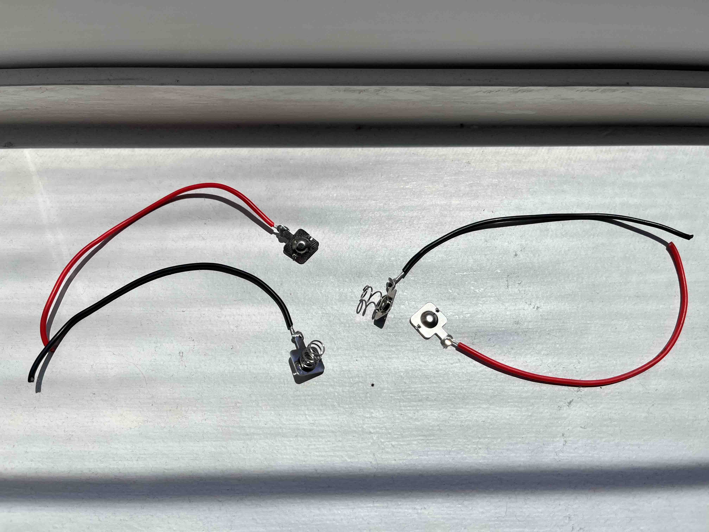
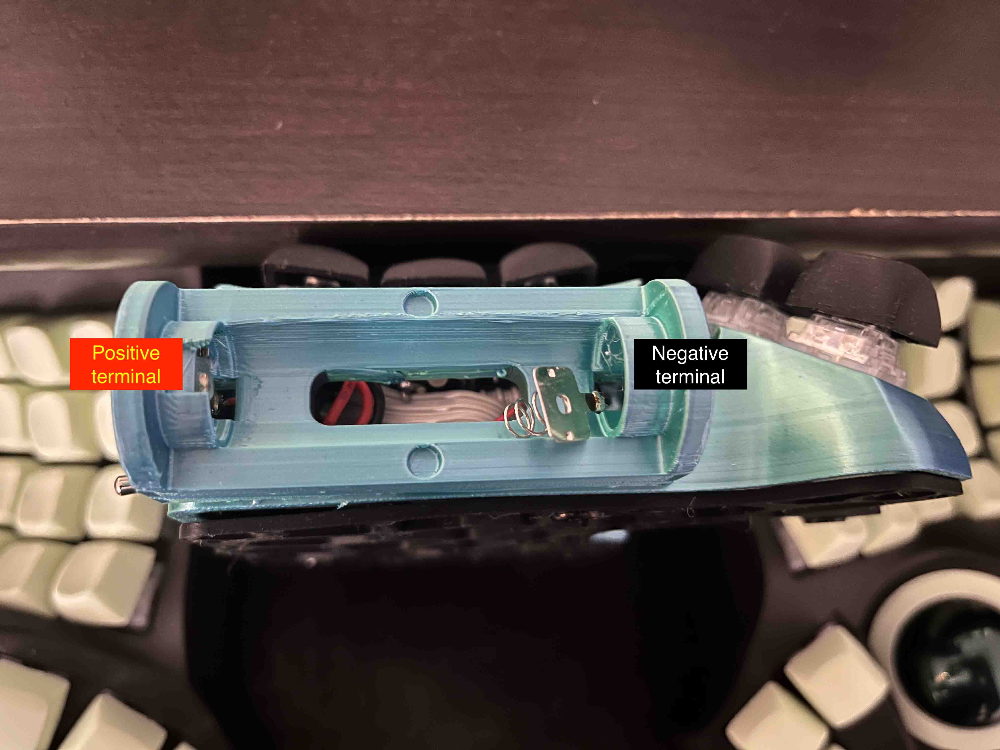

# Build Guide

Follow the wireless build guide detailed in [the 280Zo charybdis wireless mini build guide](https://github.com/280Zo/charybdis-wireless-mini-3x6-build-guide). We use the same build with modifications in 2 places:

- battery
- toggle switch

# Table of contents
- [Build Guide](#build-guide)
- [Table of contents](#table-of-contents)
- [Required Materials](#required-materials)
- [Battery Connections](#battery-connections)
- [Toggle Switch](#toggle-switch)
- [Battery Holder Cover](#battery-holder-cover)
- [Notes](#notes)

# Required Materials

| Part                                                                                                                                                                                           | Quantity |
| ---------------------------------------------------------------------------------------------------------------------------------------------------------------------------------------------- | -------- |
| 14500 3.7v AA Battery (14mm*50mm)                                                                                                                                                   | 2        |
| [AA Battery Contact Plates - max dimensions 10mm*10mm](https://www.aliexpress.com/item/2251832697974737.html?spm=a2g0o.order_list.order_list_main.104.45091802w1A1m8)                          | 2 pairs  |
| [Vertical Right Angle Toggle Switch  - 7mm MTS-102C3 variant](https://www.aliexpress.us/item/3256808105874261.html?spm=a2g0o.order_list.order_list_main.11.45091802w1A1m8&gatewayAdapt=glo2usa) | 1        |
| Cylindrical Magnets (4mm*2mm)                                                                                                                                                       | 1        |

# Battery Connections

1. Solder the wires to the AA battery contact plates
1. Insert the wires soldered to the battery contact plates through the holes in the battery holder
1. Note that the negative terminal wire (the one attached to the spring plate) will go inside the hole in the battery holder that is closest to the thumb cluster. You will be able to visually notice that this side has more depth so as to house the spring
1. Once inserted through these holes, solder the battery terminal wires to the appropriate battery power pins

|  |
| :--------------------------------: |
|           Battery Plates           |

|  |
| :-----------------------------: |
|         Battery Inserts         |

# Toggle Switch

We need a toggle switch for easy access to toggle the keyboard ON/OFF.

1. Re-purpose the TRRS cable hole in the case for the toggle switch. Use a deburring tool (or soldering iron) to increase the diameter of the hole if needed
2. Depending on the switches you used, you might need to orient the switch in such a way that the pins of the toggle switches face the keycaps

# Battery Holder Cover

The dimensions of the cover are such that it exactly fits the battery holder. Using some amount of force to secure it should keep it in place firmly without any locks/magnetic snap fits.

Inserts are designed to work with cylindrical magnets of dimensions 4mm*2mm both on the battery holder and the battery cover.

# Notes

1. If the build is being done with a nice!nano or similar clone, the charge ICs onboard only have overcharge protection. It is strongly recommended make sure to use AA(14500 3.7v) cells that have their own protection circuit to prevent overdischarge/undervoltage situations
