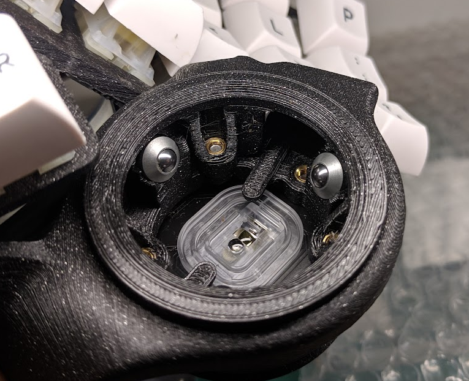
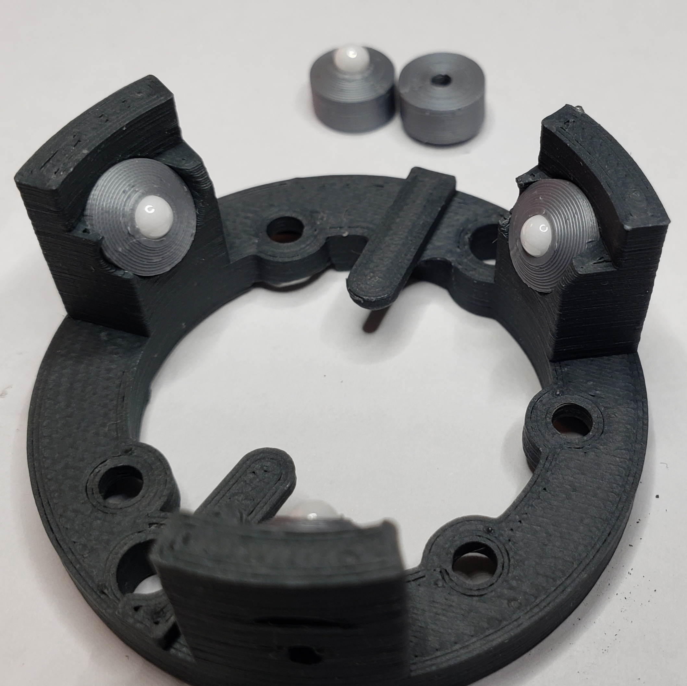
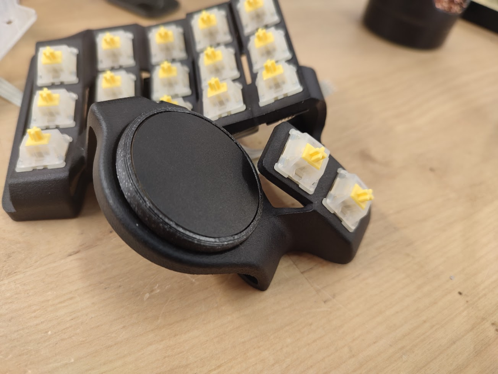
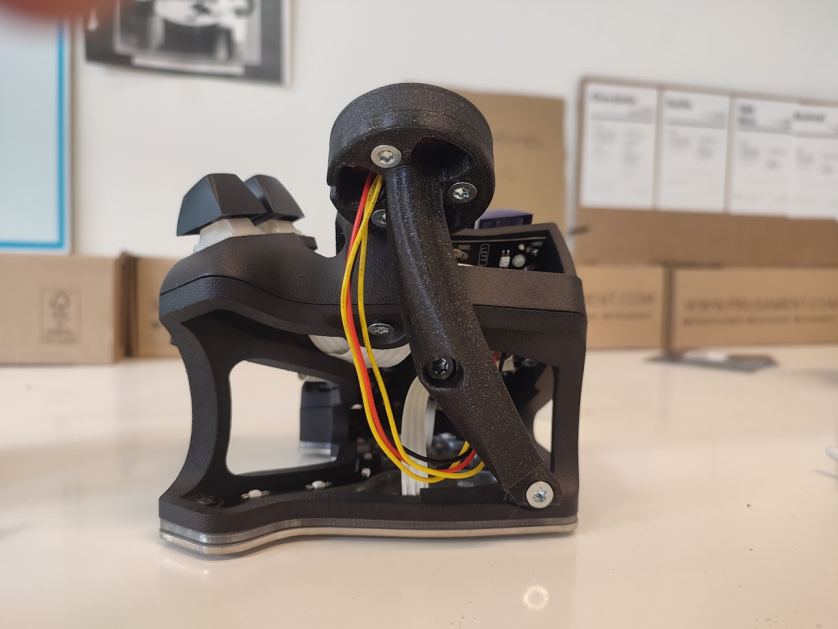
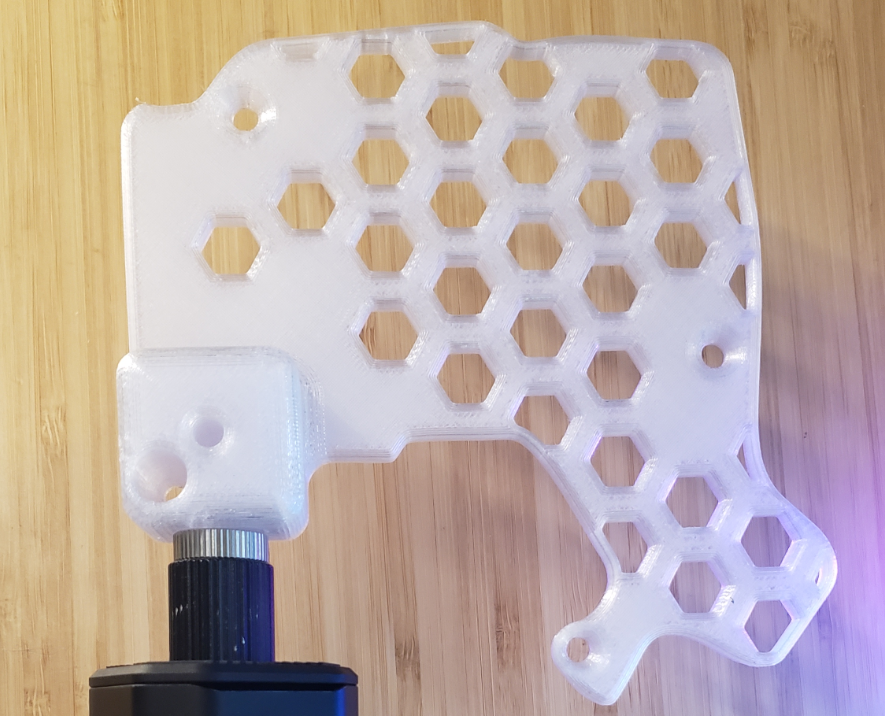
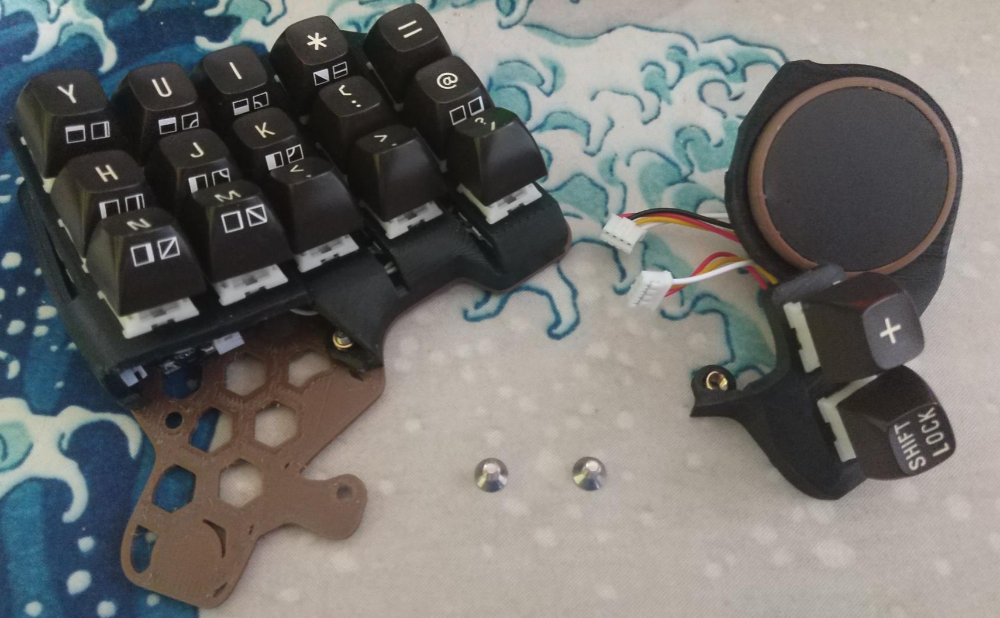
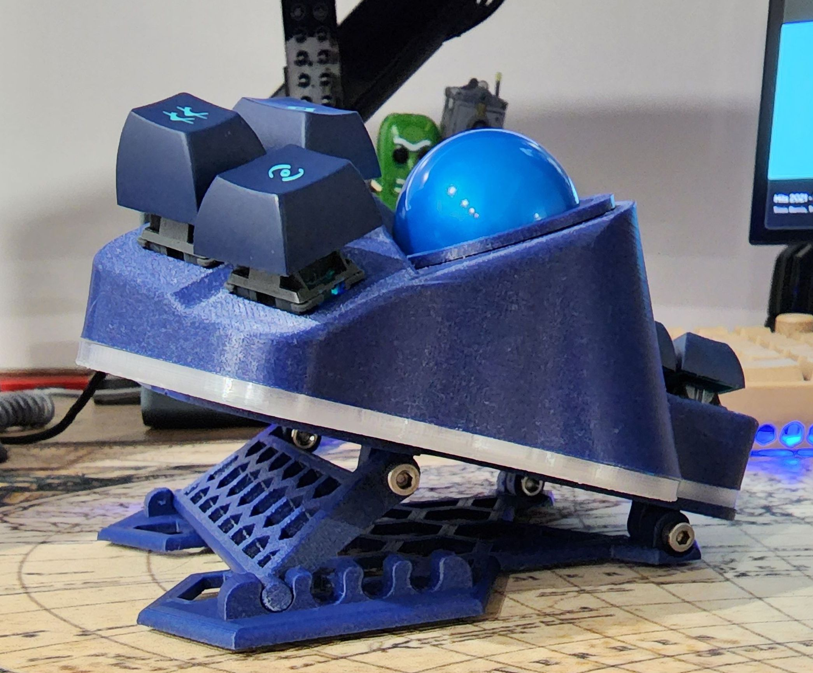
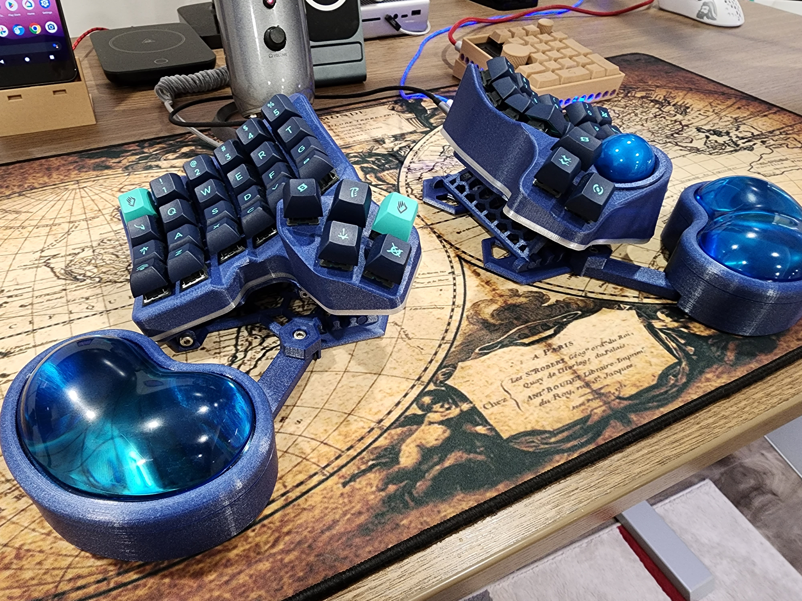

# Mods:

- [Mods:](#mods)
  - [BTU Mod](#btu-mod)
  - [Printable BTU Mod](#printable-btu-mod)
  - [Printable BTU Mod - with screws](#printable-btu-mod---with-screws)
    - [Upgraded inserts for the Printable BTU Mod](#upgraded-inserts-for-the-printable-btu-mod)
  - [Midglow PCB for the Charybdis Nano tents](#midglow-pcb-for-the-charybdis-nano-tents)
  - [Trackpad mod for the Charybdis](#trackpad-mod-for-the-charybdis)
  - [Trackpad mod for the Charybdis Nano organic tents](#trackpad-mod-for-the-charybdis-nano-organic-tents)
  - [Chair Mount Plate](#chair-mount-plate)
  - [Modular Thumb Cluster](#modular-thumb-cluster)
  - [Modular adjustable tenting stand for Charybdis/Scylla](#modular-adjustable-tenting-stand-for-charybdisscylla)
    - [Base](#base)
    - [Variant with wrist wrest](#variant-with-wrist-wrest)
## BTU Mod

Very smooth, *very expensive*.

If you want to use BTUs rather than bearings, you will need to print the bottom adapter btu model, and source some 4.8mm BTUs.

The adapter model is designed around those: https://nl.rs-online.com/web/p/ball-transfer-units/7431408/.

Print:
- [adapter_btu_bottom_v32.stl](btu/adapter_btu_bottom_v32.stl)

Note/Reminder: you will need to source your own 4.8mm BTU

## Printable BTU Mod

Pretty smooth, *less expensive*.

You can use this option if you don't want to use bearings or buy the expensive BTU part. 
There are files for 3.175mm (1/8"), and 2.5mm balls, you will need to print 3 of them as well as the bottom btu model. 

Press the balls into the model then insert them into the bottom btu model.

Links:
- [Bottom BTU Model](printable-btu-screws/bottom.stl)
- [Inserts](printable-btu) (choose either 3.175mm or 2.5mm)

## Printable BTU Mod - with screws

Uses screws instead of pression fit to hold the ball inserts in the model. You will need M3 4mm screws.

Two versions : with 3.175mm balls, and 4mm balls.

Print:
- [Bottom BTU Model](printable-btu-screws/bottom.stl)
- [3.175mm insert](printable-btu-screws/balls-3.1mm/inserts.stl)
- [4mm insert](printable-btu-screws/balls-4mm/inserts.stl)

### Upgraded inserts for the Printable BTU Mod

A bit taller of inserts, at 5mm tall, and a little more pronounced recess for the bearing ball.

The snap of the bearing ball is a little less intense as a result and gives more surface angle for the ball to rest on, resulting in a more secure seat for the ball.

Print:
- [Bottom BTU Model](printable-btu-screws/bottom.stl)
- [tall-inserts.stl](printable-btu-screws/balls-3.1mm/tall-inserts.stl)

Print and snap off supports. Sand the burrs if necessary.

## Midglow PCB for the Charybdis Nano tents

Check repo here: https://github.com/Bastardkb/Charybdis-nano-tent-glow

**Please note only the organic tent is compatible with the midglow rgb !**

## Trackpad mod for the Charybdis

Print the 2 files in the `mods/trackpad/trackball-holder` folder. Install in place of the trackball holder.
Connect the trackpad to sda, scl, vcc, gnd.

Required hardware:

| Part name                         | Amount | Link                                                                                    |
| --------------------------------- | ------ | --------------------------------------------------------------------------------------- |
| M4 8mm Torx Screw                 | 1      | Conrad                                                                                  |
| M4 screw insert, M4 X D6.0 X L5.0 | 1      | https://fr.aliexpress.com/item/4000232925592.html?spm=a2g0s.12269583.0.0.6aef4f282LZO4v |

## Trackpad mod for the Charybdis Nano organic tents

Print the 2 files in the `mods/trackpad/3x5-tent` folder. Install on the organic tent, connect to sda, scl, vcc, gnd.

Required hardware:

| Part name                         | Amount | Link                                                                                    |
| --------------------------------- | ------ | --------------------------------------------------------------------------------------- |
| M4 8mm Torx Screw                 | 5      | Conrad                                                                                  |
| M4 screw insert, M4 X D6.0 X L5.0 | 5      | https://fr.aliexpress.com/item/4000232925592.html?spm=a2g0s.12269583.0.0.6aef4f282LZO4v |

## Chair Mount Plate
Alternate bottom plate for mounting to a chair or desk using standard camera mounting equipment. Fits 1/4 inch mounting bolt (1/4-20 UNC).
Found in the `3x5 nano/chairMountPlate` folder.  

## Modular Thumb Cluster
Based on the 3x5 Skeletyl/Charybdis Nano. This has a slightly modified plate, a 3 switch thumb cluster (ala Skeletyl), a 2 switch thumb cluster with the mount for a trackball/trackpad (ala Charybdis Nano) and a modified main body

Note: Below picture uses a standard Skeletyl main body that was cut to make room for the modular thumb cluster but a purpose printed main body should give better results!

| Part name                         | Amount | Link                                                                                    |
| --------------------------------- | ------ | --------------------------------------------------------------------------------------- |
| M4 8mm Torx Screw                 | 2      | Conrad                                                                                  |
| M4 screw insert, M4 X D6.0 X L5.0 | 2      | https://fr.aliexpress.com/item/4000232925592.html?spm=a2g0s.12269583.0.0.6aef4f282LZO4v |

## Modular adjustable tenting stand for Charybdis/Scylla

Details: [tenting-stand-with-wrist-pads/readme.md](tenting-stand-with-wrist-pads/readme.md)

### Base

### Variant with wrist wrest

