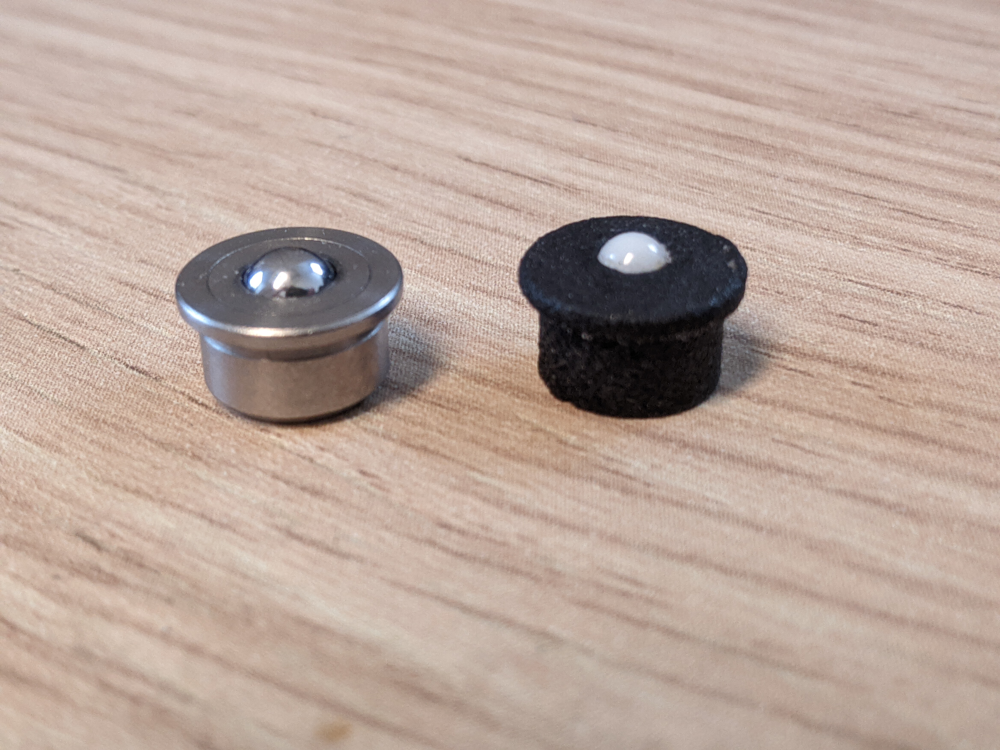
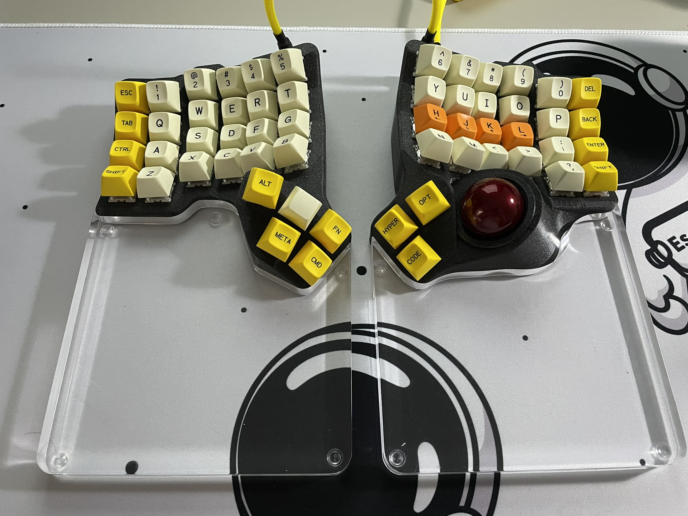
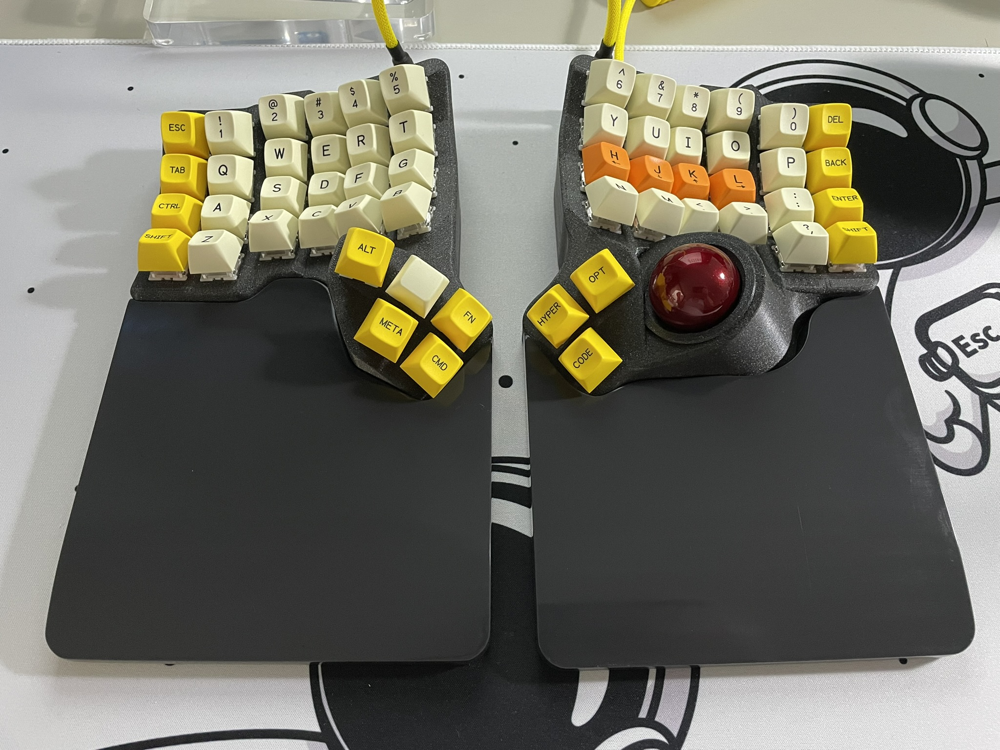

# Table of contents

- [Table of contents](#table-of-contents)
- [Charybdis - generic](#charybdis---generic)
  - [BTU Mod](#btu-mod)
  - [Veichu Bearing Mod](#veichu-bearing-mod)
  - [Static Bearing Mod - Veichu drop-in replacement](#static-bearing-mod---veichu-drop-in-replacement)
  - [Static Bearing Mod](#static-bearing-mod)
  - [Static Bearing Mod - with screws](#static-bearing-mod---with-screws)
    - [Upgraded inserts for the Static Bearing Mod](#upgraded-inserts-for-the-static-bearing-mod)
  - [Trackpad mod for the Charybdis](#trackpad-mod-for-the-charybdis)
  - [Alternative sensors](#alternative-sensors)
- [Charybdis](#charybdis)
  - [Palm Rest](#palm-rest)
    - [Straight mod](#straight-mod)
    - [Slope mod](#slope-mod)
  - [Palm Rest for Charybdis 4x6 MKII](#palm-rest-for-charybdis-4x6-mkii)
  - [Modular adjustable tenting stand for Charybdis/Scylla](#modular-adjustable-tenting-stand-for-charybdisscylla)
    - [Base](#base)
    - [Variant with wrist wrest](#variant-with-wrist-wrest)
- [Charybdis Nano](#charybdis-nano)
  - [Midglow PCB for the Charybdis Nano tents](#midglow-pcb-for-the-charybdis-nano-tents)
  - [Trackpad mod for the Charybdis Nano organic tents](#trackpad-mod-for-the-charybdis-nano-organic-tents)
  - [Chair Mount Plate](#chair-mount-plate)
  - [Modular Thumb Cluster](#modular-thumb-cluster)
  - [Sensor cover](#sensor-cover)
  - [Trackball retainer](#trackball-retainer)

# Charybdis - generic

## BTU Mod

Very smooth, *very expensive*.

If you want to use BTUs rather than bearings, you will need to print the bottom adapter btu model, and source some 4.8mm BTUs.

The adapter model is designed around those: https://nl.rs-online.com/web/p/ball-transfer-units/7431408/.

Print the file in the `btu` folder.

## Veichu Bearing Mod

The veichu bearings are a cheaper alternative to the BTUs.

This uses the 7.5mm Veichu VCN310 variant.

They need to be press-fitted into the 3d print, as they have no screws.

There are 2 different versions in the `veichu` folder:

- [Bottom Veichu Model](veichu/veichu.stl) : uses M3 screw inserts
- [Bottom M3 Veichu Model](veichu/veichu_M3_screw.stl) : has M3 threads directly into the plastic, no inserts needed

## Static Bearing Mod - Veichu drop-in replacement

A static bearing mod, that is a drop-in replacement for the 7.5mm Veichu VCN310 BTU.

The inserts were tested to work with MJF printing from JLCPCB. Different printing techniques have different tolerances, so you results may vary when printing with different techniques.

It was designed for 3mm ceramic balls. They press fit into the holders, can take quite a bit of force to press in. Recommend to press against a hard object like your desk.

Links:
- Use either version of the bottom models from the Veichu folder: [Bottom Veichu Model](veichu/veichu.stl) OR [Bottom M3 Veichu Model](veichu/veichu_M3_screw.stl)
- Use the [Inserts](Static-bearing-Veichu-drop-in/Static-bearing-holder_v221117.stl) from the static-bearing-veichu-drop-in folder.

## Static Bearing Mod

Pretty smooth, *less expensive*.

You can use this option if you don't want to use bearings or buy the expensive BTU part.
There are files for 3.175mm (1/8"), and 2.5mm balls, you will need to print 3 of them as well as the bottom btu model.

Press the balls into the model then insert them into the modified [bottom btu model](btu/adapter_btu_bottom_v32.stl).

Links:
- [Bottom BTU Model](btu/adapter_btu_bottom_v32.stl)
- [Inserts](static-bearing) (choose either 3.175mm or 2.5mm)

## Static Bearing Mod - with screws

Uses screws instead of pression fit to hold the ball inserts in the model. You will need M3 4mm screws.

Two versions : with 3.175mm balls, and 4mm balls.

Print:
- [Bottom BTU Model](static-bearing-screws/bottom.stl)
- [3.175mm insert](static-bearing-screws/balls-3.1mm/inserts.stl)
- [4mm insert](static-bearing-screws/balls-4mm/inserts.stl)

### Upgraded inserts for the Static Bearing Mod

A bit taller of inserts, at 5mm tall, and a little more pronounced recess for the bearing ball.

The snap of the bearing ball is a little less intense as a result and gives more surface angle for the ball to rest on, resulting in a more secure seat for the ball.

Print:
- [Bottom BTU Model](static-bearing-screws/bottom.stl)
- [tall-inserts.stl](static-bearing-screws/balls-3.1mm/tall-inserts.stl)

Print and snap off supports. Sand the burrs if necessary.

## Trackpad mod for the Charybdis

Print the 2 files in the `mods/trackpad/trackball-holder` folder. Install in place of the trackball holder.
Connect the trackpad to sda, scl, vcc, gnd.

Required hardware:

| Part name                         | Amount | Link                                                                                    |
| --------------------------------- | ------ | --------------------------------------------------------------------------------------- |
| M4 8mm Torx Screw                 | 1      | Conrad                                                                                  |
| M4 screw insert, M4 X D6.0 X L5.0 | 1      | https://fr.aliexpress.com/item/4000232925592.html?spm=a2g0s.12269583.0.0.6aef4f282LZO4v |

## Alternative sensors

There are files in the [`bottom_adapter_alternative_sensors`](./bottom_adapter_alternative_sensors/README.md) directory to accomodate PMW3389 and ADNS9800 sensor PCBs.

# Charybdis

## Palm Rest

Those palm rests are to be placed at the bottom of the keyboard, to support your palms. There are both sloped and straight versions.

For each version, there are 3 files:

- `STL`: for 3D printing
- `DWG`: for laser cutting
- `SLDPRT`: solidworks source file

The files for the Charybdis and Scylla are different:
- For the Charybdis, use the files in [4x6-palm-rest](4x6-palm-rest)
- For the Scylla, use the files from the [palm rest folder](https://github.com/Bastardkb/Scylla/tree/main/files/palm-rest)

### Straight mod

### Slope mod

## Palm Rest for Charybdis 4x6 MKII

Wrist rests designed for larger cloth rubber mats like this one here: <https://aliexpress.com/item/1005004557222656.html>

## Modular adjustable tenting stand for Charybdis/Scylla

Details: [tenting-stand-with-wrist-pads/readme.md](tenting-stand-with-wrist-pads/readme.md)

### Base

### Variant with wrist wrest

# Charybdis Nano

## Midglow PCB for the Charybdis Nano tents

Check repo here: https://github.com/Bastardkb/Charybdis-nano-tent-glow

**Please note only the organic tent is compatible with the midglow rgb !**

## Trackpad mod for the Charybdis Nano organic tents

Print the 2 files in the `mods/trackpad/3x5-tent` folder. Install on the organic tent, connect to sda, scl, vcc, gnd.

Required hardware:

| Part name                         | Amount | Link                                                                                    |
| --------------------------------- | ------ | --------------------------------------------------------------------------------------- |
| M4 8mm Torx Screw                 | 5      | Conrad                                                                                  |
| M4 screw insert, M4 X D6.0 X L5.0 | 5      | https://fr.aliexpress.com/item/4000232925592.html?spm=a2g0s.12269583.0.0.6aef4f282LZO4v |

## Chair Mount Plate
Alternate bottom plate for mounting to a chair or desk using standard camera mounting equipment. Fits 1/4 inch mounting bolt (1/4-20 UNC).
Found in the `3x5 nano/chairMountPlate` folder.

## Modular Thumb Cluster
Based on the 3x5 Skeletyl/Charybdis Nano. This has a slightly modified plate, a 3 switch thumb cluster (ala Skeletyl), a 2 switch thumb cluster with the mount for a trackball/trackpad (ala Charybdis Nano) and a modified main body

Note: Below picture uses a standard Skeletyl main body that was cut to make room for the modular thumb cluster but a purpose printed main body should give better results!

| Part name                         | Amount | Link                                                                                    |
| --------------------------------- | ------ | --------------------------------------------------------------------------------------- |
| M4 8mm Torx Screw                 | 2      | Conrad                                                                                  |
| M4 screw insert, M4 X D6.0 X L5.0 | 2      | https://fr.aliexpress.com/item/4000232925592.html?spm=a2g0s.12269583.0.0.6aef4f282LZO4v |

## Sensor cover

A trackball sensor cover to be used in combination with the original bottom cover. Protects the sensor from outside elements.

File is in [trackball-cover](trackball-cover).

## Trackball retainer

Use in place of adapter_v2_top_v75.stl to prevent balls from falling.
Adjusting the height for [static-beraing-screws](static-bearing-screws).

Rotating the ball may be difficult at first, but you will get used to it by putting it on and taking it off a few times and rotating it.
The screw holes of this part have an inner diameter (5mm) that allows you to glue M3 (x5x5) threaded inserts.

There are both 3x5 and 4x6 versions.

