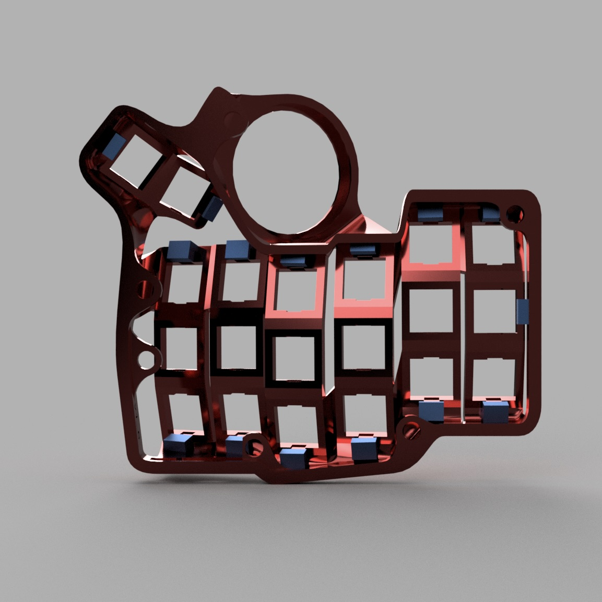
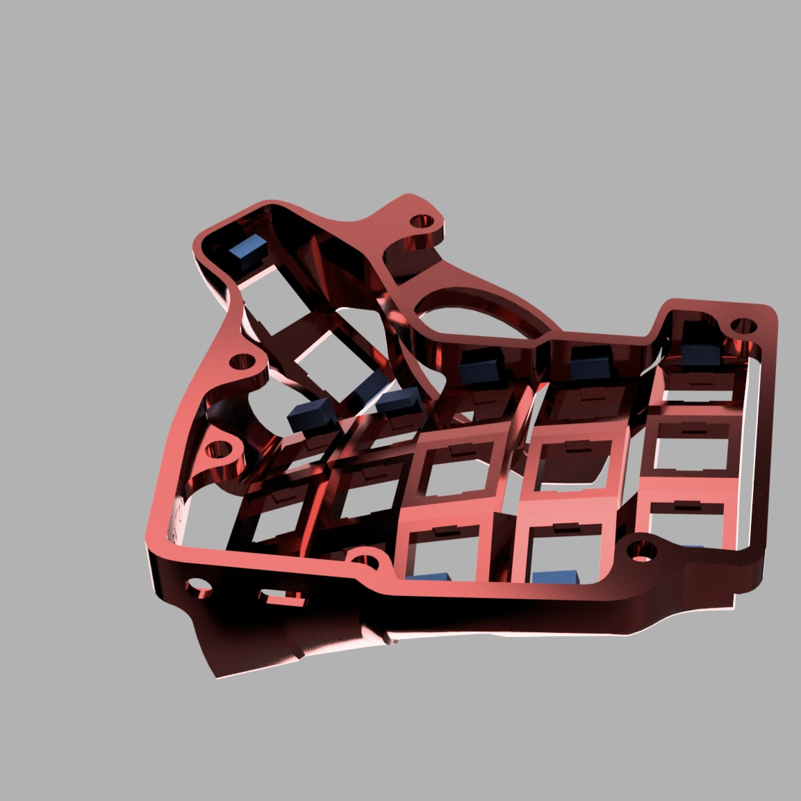

# Snap Fit Cases for Charybdis Mini and Charybdis Nano

The conventional build for the Charybdis line of keyboards is to solder the switches to the PCB. This helps to hold the PCB firmly in place. \

To make the Charybdis hot swappable, some force is required to keep the PCB pushed against the keyboard case. This can be achieved with:

- using copious amounts of hot glue and/or tape
- handwire each hotswap socket 
- the snap fits in this repository

The snap fit files are for the Charybdis Mini. The rest of the keyboards have not been tested.

# 3D Model Files

The files are in the `charybdis_nano` and `charybdis_mini` folder.

# Renders

Charybdis Mini snap fit case (right):

Charybdis Nano snap fit case (right):

# Build images

This project is used to build the project "Charybdis Mini and Charybdis Nano with AA battery". Attached are images of the front and rear view of the Charybdis Mini case with snapfits and millmax-hotswappable PCBs.

Charybdis Mini snap fit case bottom view (left):

Charybdis Nano snmap fit case top view (left):

# Installation
Installation is trivial:

1. Insert the PCBs from [Bastard Keyboards](https://bastardkb.com/) by bending them and locking them in the snap fits.
2. Exercise caution when bending the thumb PCB cluster as they might not be as flexible as the 3x6 or 3x5 PCB plates.
3. In case you are unable to fit the PCBs in the snap fits: One potential check would be to ensure there are no supports under the snap fits.
