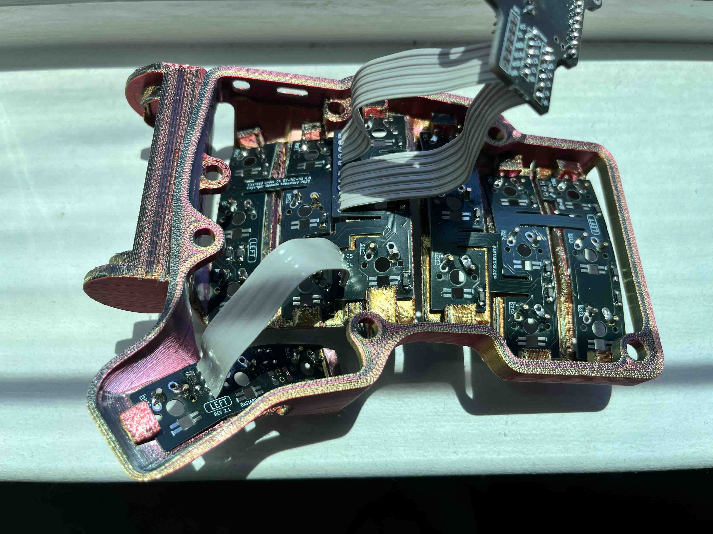
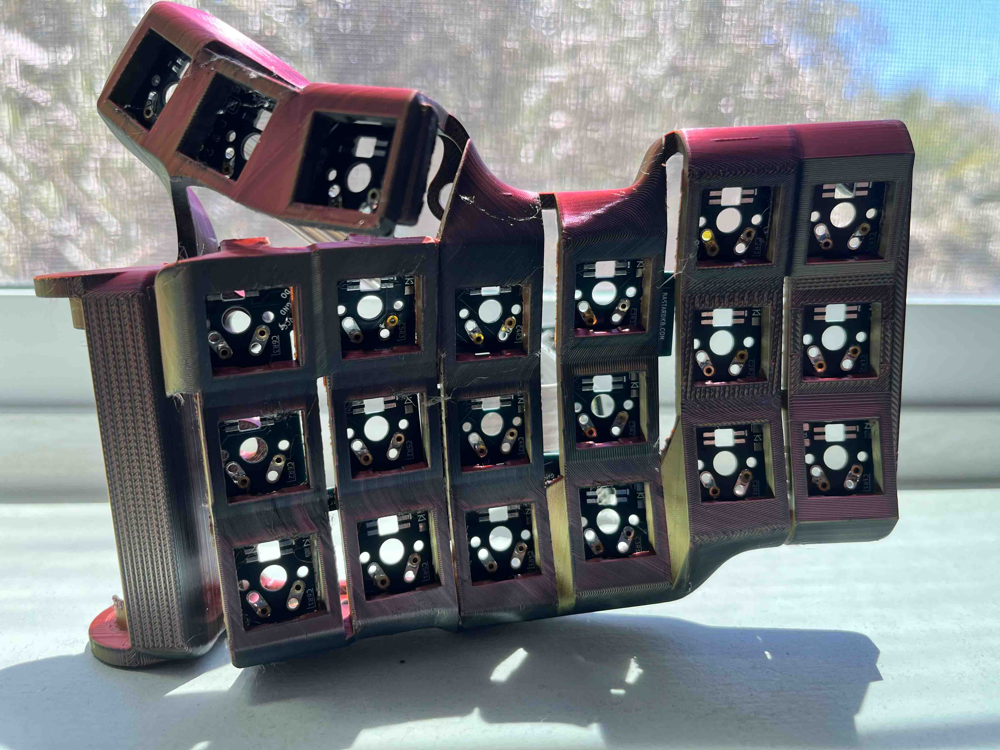

## Verification

I have only verified the prints for the below models:

1. Snap Fit Cases for Charybdis Mini

Versions for Charybdis Nano are not yet tested, this document will be updated in the future when it is tested.

# Snap Fit Cases for Charybdis Mini and Charybdis Nano

Charybdis is an ergonomic, open source keyboard designed and developed by [Bastardkb](https://github.com/Bastardkb/Charybdis).

The conventional build for the Charybdis line of keyboards is to solder the switches to the PCB. This helps to hold the PCB firmly in place. To make the Charybdis hot swappable, some force is required to keep the PCB pushed against the keyboard case. Using copious amounts of hot glue and/or tape is one option to achieve this. Another way is to handwire each switch. These solutions seemed cumbersome to me.

My contribution towards this project is the addition of snap fits to secure the PCB provided by [Bastard Keyboards](https://bastardkb.com/). This repository contains files for the right and left cases for the "Mini" and "Nano" versions of Charybdis.

## RENDERS
### CHARYBDIS MINI SNAP FIT CASE RENDER (RIGHT)

### CHARYBDIS NANO SNAP FIT CASE RENDER (RIGHT)

## BUILD IMAGES
This project is used to build the project [Charybdis Mini and Charybdis Nano with AA battery](https://github.com/rohithjayarajan/charybdis_mini_nano_AA_battery). Attached are images of the front and rear view of the Charybdis Mini case with snapfits and millmax-hotswappable PCBs.

### CHARYBDIS MINI SNAP FIT CASE BOTTOM VIEW (LEFT)

### CHARYBDIS NANO SNAP FIT CASE TOP VIEW (LEFT)

## INSTALLATION
Installation is trivial:

1. Insert the PCBs from [Bastard Keyboards](https://bastardkb.com/) by bending them and locking them in the snap fits.
2. Exercise caution when bending the thumb PCB cluster as they might not be as flexible as the 3x6 or 3x5 PCB plates.
3. In case you are unable to fit the PCBs in the snap fits: One potential check would be to ensure there are no supports under the snap fits.
