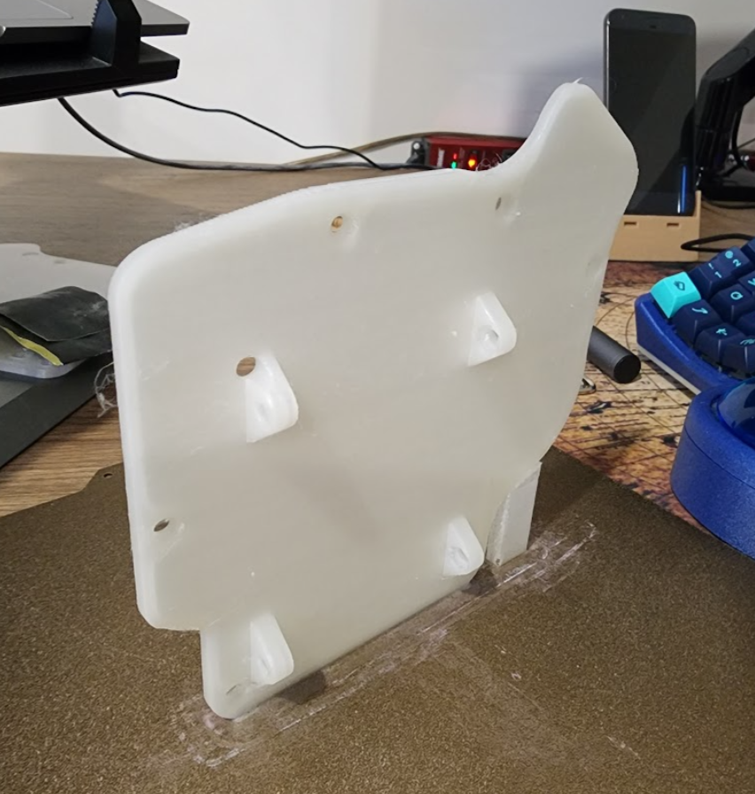
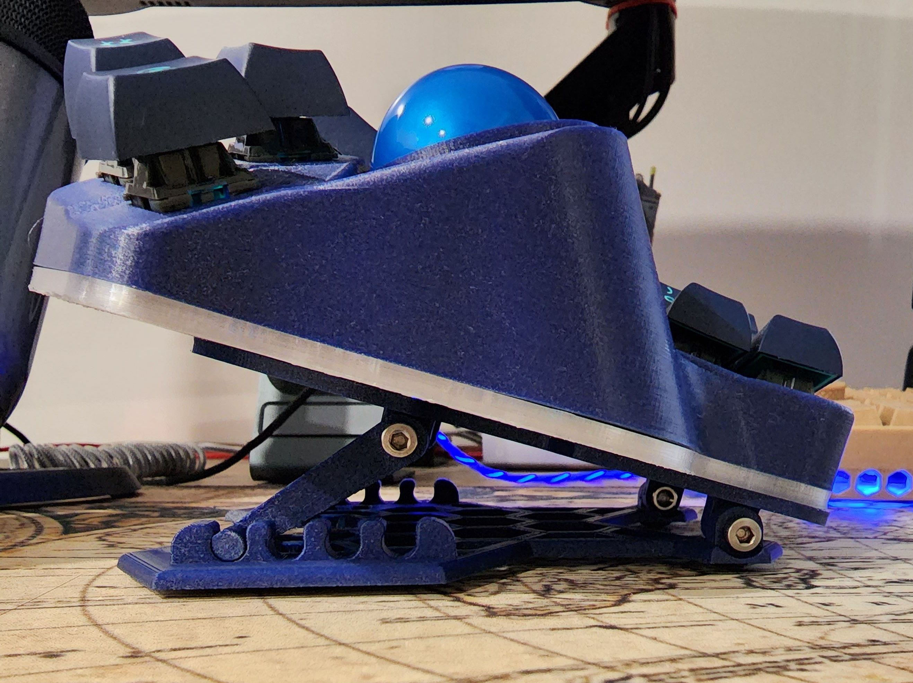
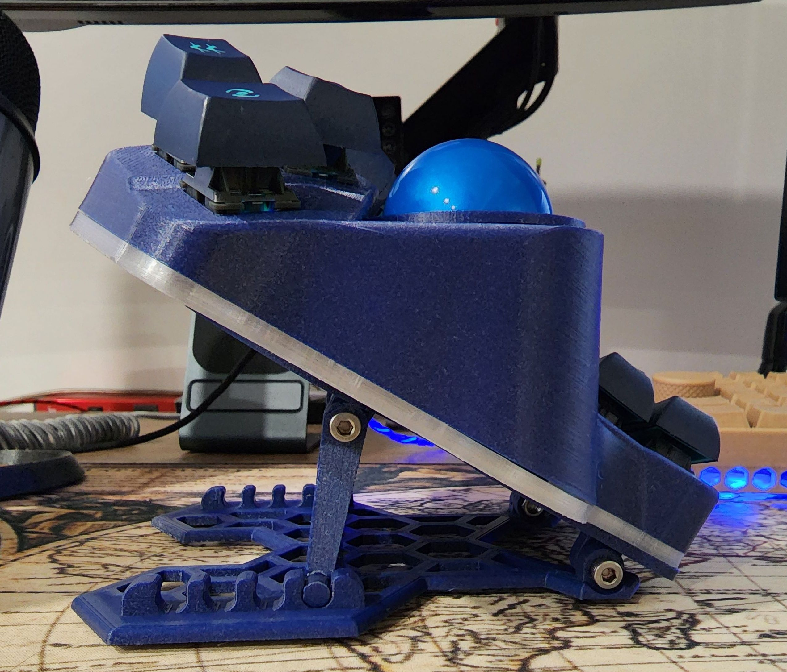
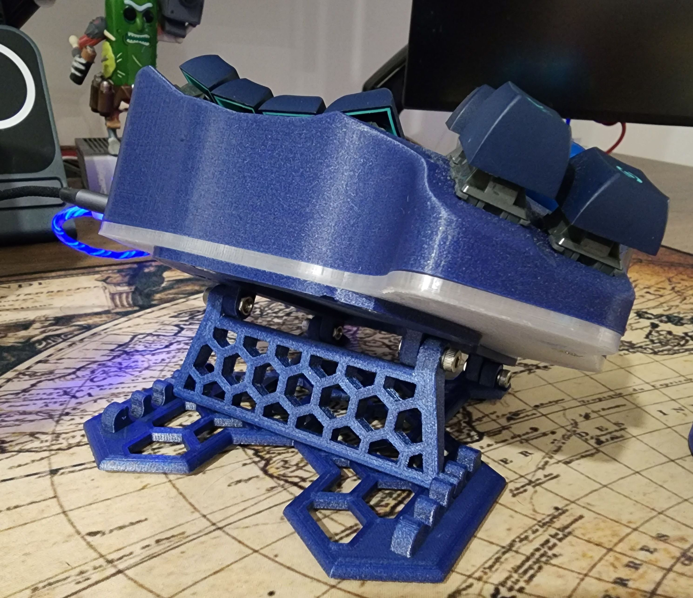
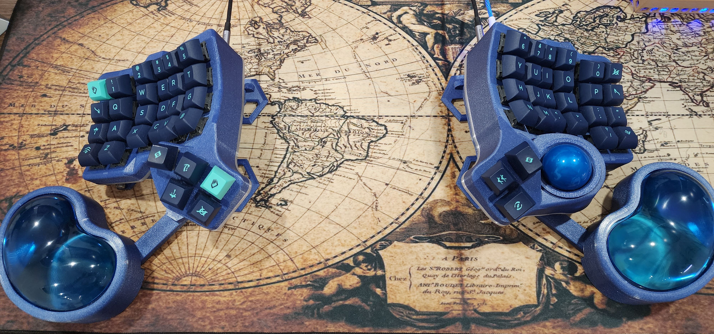
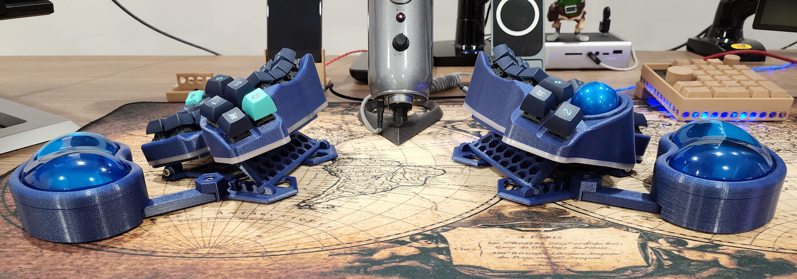
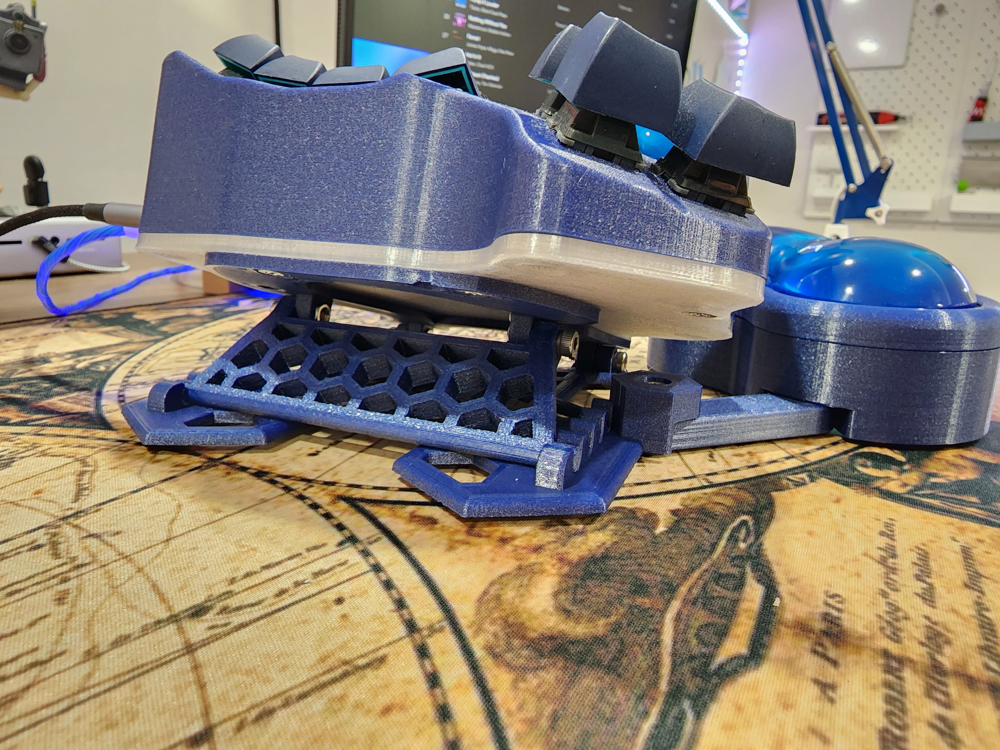

# Modular adjustable tenting stand for Charybdis/Scylla

## Required hardware

| Part name | Amount | Link |
|---|---|---|
| M4 nuts | 8 | Anywhere |
| M4 bolts 14+mm length | 8 | Anywhere |
| For wrist support generic mouse gel pads from ali or amazon | 2 | [Ali](https://www.aliexpress.com/item/1005003137481242.html) or [Amzn](https://a.co/d/4aokloi) |

## Base

## Variant with wrist wrest

## Printing

### Base parts

- [Bottom - bottom.3mf](bottom.3mf)
- [Top plate - plate.3mf](plate.3mf) - This must be mirrored for another side
  
  Alternatively you can print remixed bottom case plates for Scylla/Charybdis, mirror appropriately if required. This should reduce several millimeters.
  
  - [Scylla bottom plate hinges](left-case-bottom-scylla.3mf)
  - [Charybdis bottom plate with hinges](right-case-bottom-charybdis.3mf)

  Print them vertically like so: 
  
- [Tending arm - tenting-arm.3mf](tenting-arm.3mf)

### Additional parts for wrist wrest

See folder `wrist-pad-variant-parts` for more files

- [Bottom plate with attachment](wrist-pad-variant-parts/bottom-with-pad-connector.3mf) - This must be mirrored for another side, also ensure pads arm attachment has supports.
- [Top part that hold gel pad - pads-holder.3mf](wrist-pad-variant-parts/pads-holder.3mf)
- [Bottom part that connect to the arm - pads-base.3mf](wrist-pad-variant-parts/pads-base.3mf)
- [Connecting arm - pads-arm.3mf](wrist-pad-variant-parts/pads-arm.3mf)
- [Optional hight extension - pads-optional-extension.3mf](wrist-pad-variant-parts/pads-optional-extension.3mf)

## Source

If you wanna play around with models, I've attached fusion files:

- [Charybdis adjustable plate v3.f3d](charybdis%20adjustable%20plate%20v3.f3d) 
- [pads.f3d](wrist-pad-variant-parts/pads.f3d)

## Gallery

