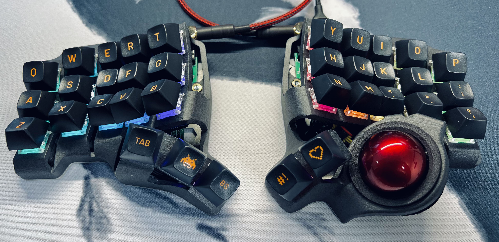

# Charybdis

An ergonomic keyboard with integrated trackball.

Engineered to be a full mouse replacement solution with high-quality, custom-developed components.

There are 4x6, 3x6 "Mini" and 3x5 "Nano" versions.

Made to be used with the [Scylla](https://github.com/Bastardkb/Scylla), [TKB Mini](https://github.com/Bastardkb/TBK-Mini) or [Skeletyl](https://github.com/Bastardkb/Skeletyl) on the other half.

# Required components

## 3d prints - cases

The STL files are included in this Github repository, in the `files` folder.

Please find detailed instructions on how to print the case on the online instructions linked below.

Depending on which keyboard you are building, you will need different prints. There is a list in the table below - depending on the version number, the names will slightly vary. 

This repository is always updated with the latest version of the 3d models, and they are compatible with previous versions. For example, `charybdis.stl` might reference `charybdis3_v131.stl`.

**3d prints - 4x6**

| Description      | File                    | Notes                                                                                           |
| ---------------- | ----------------------- | ----------------------------------------------------------------------------------------------- |
| Right case       | `4x6/charybdis.stl`     |                                                                                                 |
| Left case        |                         | Download from the [Scylla repository](https://github.com/Bastardkb/Scylla)                      |
| Right plate      | `4x6/plate_shield2.stl` |                                                                                                 |
| Left plate       |                         | Download from the [Scylla repository](https://github.com/Bastardkb/Scylla)                      |
| Adapter - top    | `4x6/adapter_top.stl`   | There is a different adapter for the 4x6 and 3x5, make sure to grab the one in the 4x6 folder ! |
| Adapter - bottom | `adapter_bottom.stl`    |                                                                                                 |
| Tent - right     | `4x6/tent_alien.stl`    | Optional 30 degree tent                                                                         |
| Tent - left      | `4x6/tent_alien.stl`    | Optional 30 degree tent, mirror the file for left                                               |

**3d prints - 3x6**

| Description      | File                       | Notes                                                                                                    |
| ---------------- | -------------------------- | -------------------------------------------------------------------------------------------------------- |
| Right case       | `3x6 mini/Cmini.stl`       |                                                                                                          |
| Left case        |                            | Download from the [TBK Mini repository](https://github.com/bastardkb/tbk-Mini), mirror the file for left |
| Right plate      | `3x6 mini/plate.stl`       |                                                                                                          |
| Left plate       |                            | Download from the [TBK Mini repository](https://github.com/bastardkb/tbk-Mini), mirror the file for left |
| Adapter - top    | `3x5 nano/adapter_top.stl` | The 3x6 Mini uses the same top adapter as the 3x5 Nano                                                   |
| Adapter - bottom | `adapter_bottom.stl`       |                                                                                                          |
| Tent - right     | `3x6 mini/tent.stl`        | Optional 30 degree tent                                                                                  |
| Tent - left      | `3x6 mini/tent.stl`        | Optional 30 degree tent, mirror the file for left                                                        |

**3d prints - 3x5**

| Description      | File                           | Notes                                                                                                    |
| ---------------- | ------------------------------ | -------------------------------------------------------------------------------------------------------- |
| Right case       | `3x5 nano/charybdisnano.stl`   |                                                                                                          |
| Left case        |                                | Download from the [Skeletyl repository](https://github.com/bastardkb/skeletyl), mirror the file for left |
| Right plate      | `3x5 nano/plate.stl`           |                                                                                                          |
| Left plate       |                                | Download from the [Skeletyl repository](https://github.com/bastardkb/skeletyl), mirror the file for left |
| Adapter - top    | `3x5 nano/adapter_top.stl`     | There is a different adapter for the 4x6 and 3x5, make sure to grab the one in the 3x5 folder !          |
| Adapter - bottom | `adapter_bottom.stl`           |                                                                                                          |
| Tent - right     | `3x5 nano/tent/alien/tent.stl` | Optional tent*                                                                                           |
| Tent - left      | `3x5 nano/tent/alien/tent.stl` | Optional tent, mirror the file for left*                                                                 |

*If you are printing tents, there are multiple ones available for the Charybdis Nano. We recommend using the latest design which is the strongest and easiest to print - the alien version. There are both 30 and 15 degree versions available.

## Get a kit from BastardKB

You can get a full Kit, including case and all PCBs and electronics required on the shop:
https://bastardkb.com/

If you want to print the case yourself, you can also get just the electronics Kit.

## Electronic components

If you are sourcing the electronic components yourself, you can find a BOM in the [BOM](electronics_bom.md) file.

## Mods

There are some mods to add BTUs or ball bearings, check the *mods* folder.

# Build guide

You can find detailed instruction on the online documentation linked below.

# Links

- Discord: https://bastardkb.com/discord
- Website: https://bastardkb.com/
- Docs: https://docs.bastardkb.com

# Support me on Patreon

If you like the keyboard, please consider helping me with Patreon: https://www.patreon.com/bastardkb

I post regular updates and hindsight on my work. I work full time on keyboard innovation, and this helps a lot !

# License 

This work is licensed under a Creative Commons Attribution-NonCommercial-ShareAlike 4.0 International License.
