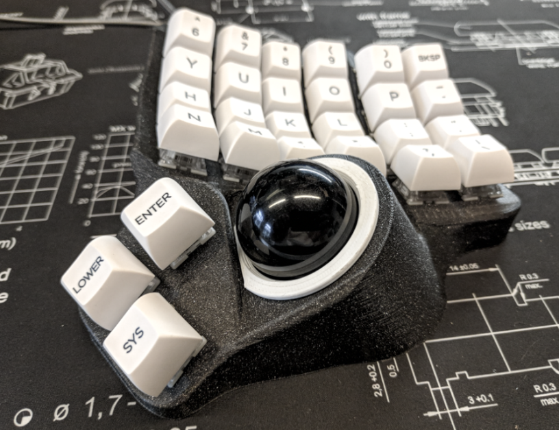

# Charybdis

An ergonomic keyboard with integrated trackball.

Engineered to be a full mouse replacement solution with high-quality, custom-developed components.

There are 6x4 and 5x3 Nano versions.

Made to be used with the Scylla or Skeletyl on the other half.

| 6x4               | 5x3 Nano           |
| ----------------- | ------------------ |
|  |  |

# Sourcing the components

## Electronic components

Depending on which version you print, you will need more or less of each component.

### For all versions

| Part name                         | Amount | Link                                                                                       |
| --------------------------------- | ------ | ------------------------------------------------------------------------------------------ |
| Elite-C                           | 2      |                                                                                            |
| Elite-C adapter for the Charybdis | 2      | https://github.com/Bastardkb/mcu-imprint-charybdis                                         |
| Cables                            |        | 28 AWG recommended                                                                         |
| Audio jack, SMD                   | 2      |                                                                                            |
| Button, 4x4x1.5                   | 2      | https://www.aliexpress.com/item/1005001304569553.html?spm=a2g0s.9042311.0.0.27424c4dDwgcp7 |
| Sensor PCB                | 1      | see details below                                                                          |
| Bearing, MR63-3x6x2.5mm                | 3      |                                                                           |

The 3d files are designed around a custom sensor PCB:

https://github.com/Bastardkb/charybdis-pmw-sensor

You will need to source all of the components from the sensor PCB's BOM.

Otherwise, you can also use other sensor PCBs, but you will need to modify the 3d adapter files.

Other components necessary:

| Part name                         | Amount (6x4) | Amount (5x3) | Link                                                                                    |
| --------------------------------- | ------ | --------------------------------------------------------------------------------------- |------ |
| Amoebas                           | 56     |    35     |    Optional, recommended                                                                                       |
| SOD123 Diodes                     | 56     | 35     |                                                                                              |
| M4 8mm Torx Screw                 | 16     | 12     |      Conrad                                                                                  |
| M4 screw insert, M4 X D6.0 X L5.0 | 16     | 12     |      https://fr.aliexpress.com/item/4000232925592.html?spm=a2g0s.12269583.0.0.6aef4f282LZO4v |
| Screws, M3 8mm Torx                | 3      |5     |                                                                                 |
| Heated screw insert, M3x5x5                | 3      |   5     |                                                                              |

## Print the case

The STL files are included in this Github.
Feel free to use and modify them at length. The files are on a non-commercial license, so this is for personal projects only - please do not use those to sell them.

Please find detailed instructions on how to print the case here:
https://docs.bastardkb.com/hc/en-us/articles/360020031180-Print-settings-for-Dactyls

You will need to print:

- ball adapter, top
- ball adapter, bottom
- ball adapter, holder

Please note the adapter of the 5x3 is not compatible with the 6x4, and vice-versa.

On top of that, for each part of the keyboard you decide to print (case, plate, tent) you will need to print the other side from the normal keyboard (eg. left Scylla/right Charybdis 6x4, left Skeletyl / right Charybdis Nano 5x3)

## Get a kit from BastardKB

You can get a full Kit, including case and all PCBs and electronics required on the shop:
https://bastardkb.com/

If you want to print the case yourself, you can also get just the electronics Kit.

# Build guide

Find the build guide at https://docs.bastardkb.com/

# Finding help

- Discord: https://bastardkb.com/discord
- Website: https://bastardkb.com/
- Docs: https://docs.bastardkb.com

# Support me on Patreon

If you like the keyboard, please consider helping me with Patreon: https://www.patreon.com/bastardkb

I post regular updates and hindsight on my work. I work full time on keyboard innovation, and this helps a lot !

# License 

This work is licensed under a Creative Commons Attribution-NonCommercial-ShareAlike 4.0 International License.
